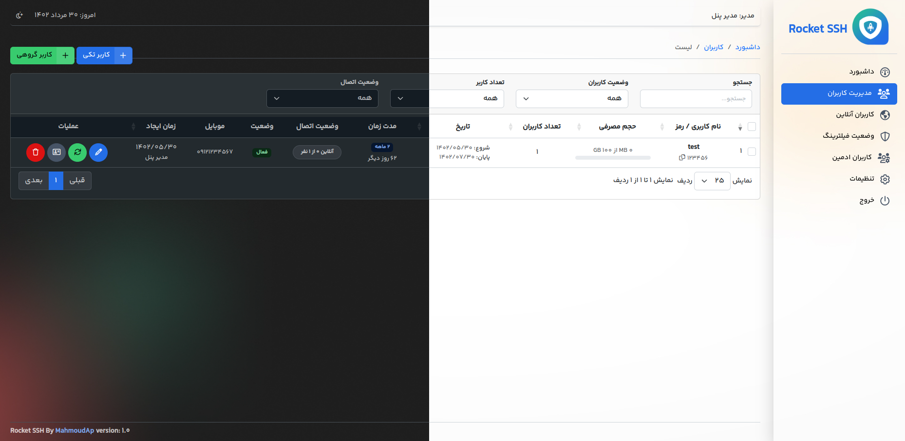

```
bash <(curl -Ls https://raw.githubusercontent.com/rocket-ap/rocket-ssh/master/install.sh --ipv4)
```

# آپدیت پنل ادمین

نیازی به نصب مجدد نیست . با این روش فقط پنل ادمین آپدیت می شود . در این روش اطلاعات دیتابیس تغییر نمی کند

```
bash <(curl -Ls https://raw.githubusercontent.com/rocket-ap/rocket-ssh/master/update-panel.sh --ipv4)
```
## فعال سازی SSL

```
bash <(curl -Ls https://raw.githubusercontent.com/rocket-ap/rocket-ssh/master/ssl.sh --ipv4)
```

# بلاک کردن آی پی های ایران

جهت بلاک کردن آی پی های ایران از دستور زیر استفاده کنید

```
bash <(curl -Ls https://raw.githubusercontent.com/rocket-ap/rocket-ssh/master/block-ir-ip.sh --ipv4)
```


# محیط نرم افزار




